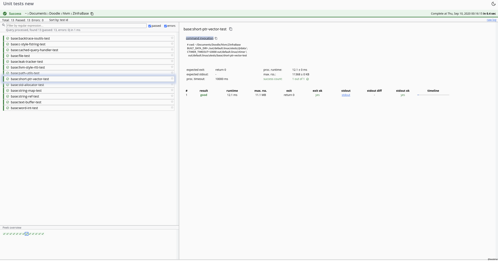
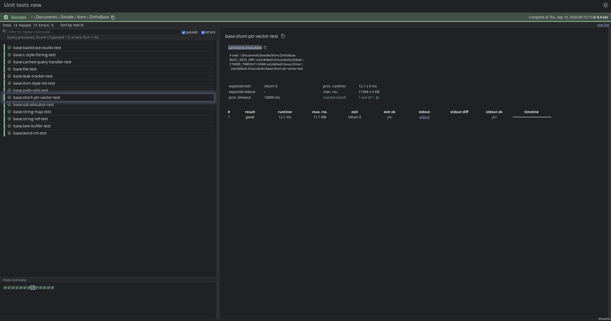
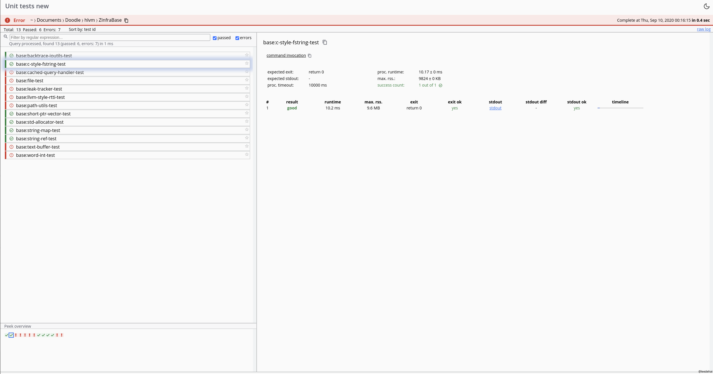
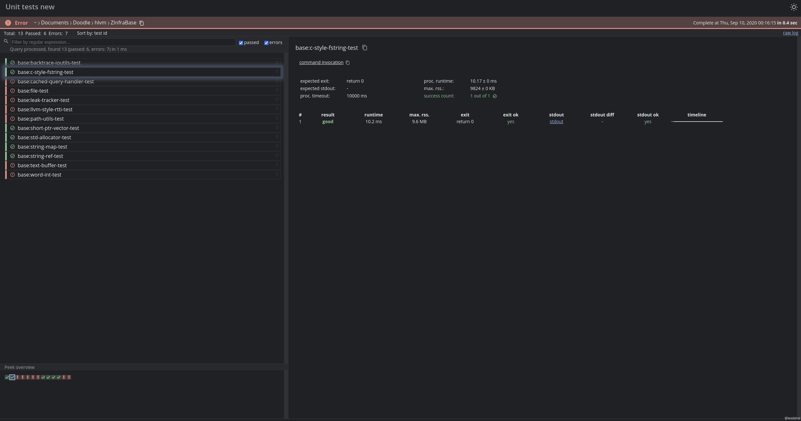
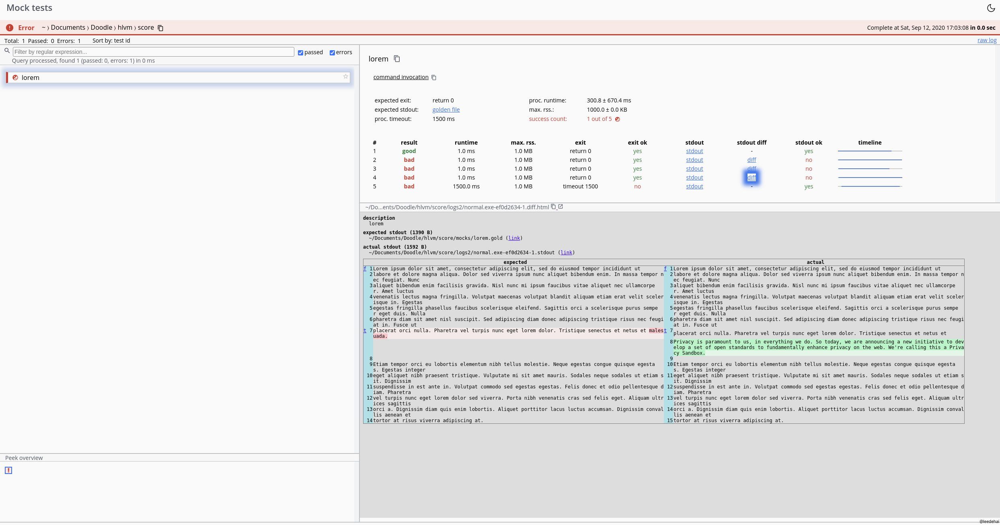
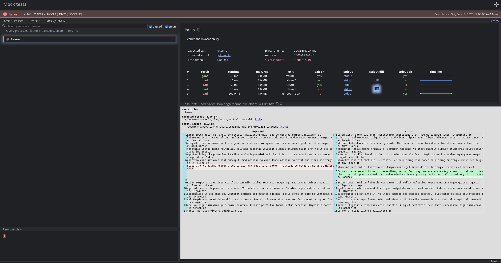

# score
> Formerly "testtools"

[](https://travis-ci.org/Leedehai/score)

Utilities to run tests.

## Prerequisites:
- Linux or macOS (Windows not tested).
- Python 3.7+, no third-party libraries needed.
- A modern web browser (optional).

## Files

### [score_run.py](score_run.py)

Run tests in parallel with designated timer.
- loads from a JSON file tests' metadata: programs, args, timeout values, expected exit and stdout, ...
- generates a log file in JSON,
- multiprocessing,
- runs each test with a timer,
- checks each test's exit status and stdout,
- if stdout is not as expected, generates a HTML for the diff
- program is self-documented
- print logs in realtime [with multiline rotation](img/multiline-rotation.md)
- takes flakiness into account

```sh
usage: score_run.py [-h] [--timer TIMER] [--meta PATH] [--paths T [T ...]]
                  [-g DIR] [-n N] [-1] [-s S] [--flakiness DIR] [-w]
                  [--only "+0,-1,+5.."] [--docs]

Test runner: with timer, logging, diff in HTML

optional arguments:
  -h, --help           show this help message and exit
  --timer TIMER        path to the timer program
  --meta PATH          JSON file of tests' metadata
  --paths T [T ...]    paths to test executables
  -g DIR, --log DIR    directory to write logs, default: ./logs
  -n N, --repeat N     run each test N times, default: 1
  -1, --sequential     run sequentially instead concurrently
  -s S, --seed S       set the seed for the random number generator
  --flakiness DIR      load flakiness declaration files *.flaky under DIR
  -w, --write-golden   write stdout to golden files instead of checking
  --docs               self-documentation in more details

Unless '--docs' is given, exactly one of '--paths' and '--meta' is needed.
```

The timer program can be compiled from [ctimer](https://github.com/Leedehai/ctimer),
written in C++ with POSIX system calls, another project of mine. Of course, you
can use your own timer program instead (e.g. one that can run on Windows), as
long as its commandline interface meets what is laid out in
`./score_run.py --docs`.

> Rewrite with [Go](https://golang.org)? Answer: not a priority, as the code
spends about 77% time in `waitpid`, 7% time in IO `read`, and 6% time in lock
acquiring - all of these costs are inherent to the logic. (Tested on Linux using
`python -m cProfile ..`).

#### Testing
Sanity test, which means the test is not complete.

```sh
sanity/check-runtest.sh
```

#### Examples
```sh
# run tests that are all good
./score_run.py --timer mocks/timer.py --meta mocks/meta-all-good.json -g logs1
# view the log as text file
vim logs1/log.json
# clear up
rm -rf logs1
```

```sh
# run tests, some of them being bad
./score_run.py --timer mocks/timer.py --meta mocks/meta-with-error.json -g logs2
# view the log as text file
vim logs2/log.json
# view the diff files in browser (their paths are found in the log)
#   on macOS, use 'open' to open files from terminal;
#   on Linux distributions, however, the most widely installed is 'xdg-open'
open logs2/normal.exe-00000.diff.html # stdout is empty
open logs2/normal.exe-fcea8.diff.html # golden file is not found
open logs2/normal.exe-6a39d.diff.html # stdout is not as expected
# clear up
rm -rf logs2
```

```sh
# write golden files (expected stdout), with some tests being bad
./score_run.py --timer mocks/timer.py --meta mocks/meta-write-golden.json -g logs3 -w
# clear up
rm -rf logs3 && rm -f delete_me.gold
```

### [score_ui.py](score_ui.py)

Generate a static page to view test results in browser. It can be used as a
standalone program or as a package.

The static page uses primitive HTML, CSS, and JS, and does not require any
third-party packages.

[More info](ui/README.md).

```
./score_ui.py -h
usage: score_ui.py [-h] [--title TITLE] --log LOG [--timer PROG] [--test-exec-path PATH]
                   [--to-dir NEW_PATH]

Static site generator for test results

optional arguments:
  -h, --help            show this help message and exit
  --title TITLE         title of tests, default: 'Tests'
  --log LOG             path to the master log, written by score_run.py
  --timer PROG          path to the timer program used to run the tests
  --test-exec-path PATH
                        working directory the tests ran at
  --to-dir NEW_PATH     directory to write results (if the directory already exits, it will be
                        replaced), default: ./html

For requirements of the timer and log file: see score_run.py --docs
```

The resulting website present a interactive view of results.
[Full features](ui/design.md).


  





Q: Where's the test for this site?<br>A: In my back-burner :persevere:. Right
now I rely on manual clicking. Yeah.. I know this approach is lame.

#### Image resource copyright

[check_logo_light.jpg](ui/static/img/check_logo_light.png): from
[this website](https://www.pinterest.com/pin/368802656984876731/), license
unknown.

# License

[MIT License](LICENSE.txt).

■
