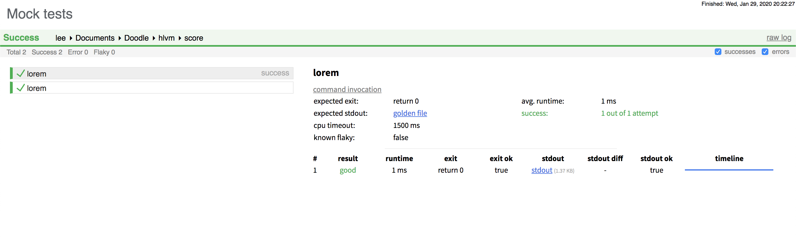
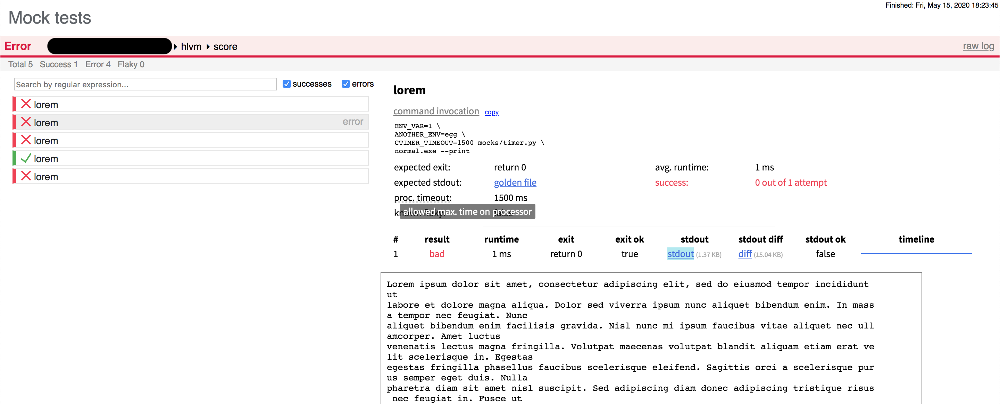

# score
> Formerly "testtools"

[](https://travis-ci.org/Leedehai/score)

Utilities to run tests.

## Prerequsites:
- Linux or macOS (Windows not tested)
- Python3.5+, no third-party libraries needed

## Files

### [score_run.py](score_run.py)

Run tests in parallel with designated timer.
- loads from a JSON file tests' metadata: programs, args, timeout values, expected exit and stdout, ...
- generates a log file in JSON,
- multiprocessing,
- runs each test with a timer,
- checks each test's exit status and stdout,
- if stdout is not as expected, generates a HTML for the diff
- program is self-documented
- print logs in realtime [with multiline rotation](img/multiline-rotation.md)
- takes flakiness into account

```sh
usage: score_run.py [-h] [--timer TIMER] [--meta PATH] [--paths T [T ...]]
                  [-g DIR] [-n N] [-1] [-s S] [--flakiness DIR] [-w]
                  [--only "+0,-1,+5.."] [--docs]

Test runner: with timer, logging, diff in HTML

optional arguments:
  -h, --help           show this help message and exit
  --timer TIMER        path to the timer program
  --meta PATH          JSON file of tests' metadata
  --paths T [T ...]    paths to test executables
  -g DIR, --log DIR    directory to write logs, default: ./logs
  -n N, --repeat N     run each test N times, default: 1
  -1, --sequential     run sequentially instead concurrently
  -s S, --seed S       set the seed for the random number generator
  --flakiness DIR      load flakiness declaration files *.flaky under DIR
  -w, --write-golden   write stdout to golden files instead of checking
  --docs               self-documentation in more details

Unless '--docs' is given, exactly one of '--paths' and '--meta' is needed.
```

The timer program can be compiled from [ctimer](https://github.com/Leedehai/ctimer),
written in C++ with POSIX system calls, another project of mine. Of course, you
can use your own timer program instead (e.g. one that can run on Windows), as
long as its commandline interface meets what is laid out in
`./score_run.py --docs`.

> Rewrite with [Go](https://golang.org)? Answer: not a priority, as the code
spends about 84% time in `waitpid`, 4% time in IO `read`, and 4% time in lock
acquiring (for stdout/stderr printing) - all of these costs are inherent
to the logic. (Tested on Linux and macOS with a realistic workload using
`python -m cProfile`).

#### Testing
Sanity test, which means the test is not complete.

```sh
sanity/check-runtest.sh
```

#### Examples
```sh
# run tests that are all good
./score_run.py --timer mocks/timer.py --meta mocks/meta-all-good.json -g logs1
# view the log as text file
vim logs1/log.json
# clear up
rm -rf logs1
```

```sh
# run tests, some of them being bad
./score_run.py --timer mocks/timer.py --meta mocks/meta-with-error.json -g logs2
# view the log as text file
vim logs2/log.json
# view the diff files in browser (their paths are found in the log)
#   on macOS, use 'open' to open files from terminal;
#   on Linux distributions, however, the most widely installed is 'xdg-open'
open logs2/normal.exe-00000.diff.html # stdout is empty
open logs2/normal.exe-fcea8.diff.html # golden file is not found
open logs2/normal.exe-6a39d.diff.html # stdout is not as expected
# clear up
rm -rf logs2
```

```sh
# write golden files (expected stdout), with some tests being bad
./score_run.py --timer mocks/timer.py --meta mocks/meta-write-golden.json -g logs3 -w
# clear up
rm -rf logs3 && rm -f delete_me.gold
```

### [score_view.py](score_view.py)

Generate a static page to view test results in browser.
It can be used as a standalone program or as a package.

> NOTE: the static page uses primitive HTML, CSS, and JS, and does not
require any third-party packages. This is ad-hoc and does not adhere
to modern best practices in website engineering (indeed, we can't use
Node, webpack etc. here). However, it is not intended to build a
complex website in the first place.

```
./score_view.py -h
usage: score_view.py [-h] [--title TITLE] --timer PROG --log LOG
                     [--to-dir NEW_PATH]

Static site generator for test results

optional arguments:
  -h, --help         show this help message and exit
  --title TITLE      title of tests, default: 'Tests'
  --timer PROG       path to the timer program used to run the tests
  --log LOG          path to the master log, written by score_run.py
  --to-dir NEW_PATH  directory to write results (if the directory already
                     exits, it will be replaced), default: ./html

For requirements of the timer and log file: see score_run.py --docs
```

The resulting website contains a expandable list of results, like this:




#### Examples
```sh
# Using score_run.py's examples above
./score_view.py --title "Mock tests" --timer mocks/timer.py --log logs1/log.json --to-dir logs1/html
./score_view.py --title "Mock tests" --timer mocks/timer.py --log logs2/log.json --to-dir logs2/html
```

#### Image resource copyright

[check_logo_light.jpg](static/img/check_logo_light.jpg): from
[this website](https://www.pinterest.com/pin/368802656984876731/), license
unknown

### [diff_html_str.py](diff_html_str.py)

Returns a valid HTML string that contains a table to render the diff view. Used
by [score_run.py](score_run.py).
> The HTML format is [diff.html](diff.html) - the placeholders are `%s` instead
of `{slot_name}` because escaping `{` and `}` distorts the CSS definition
statements.

###### EOF
